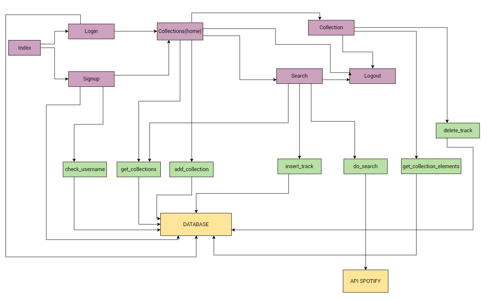
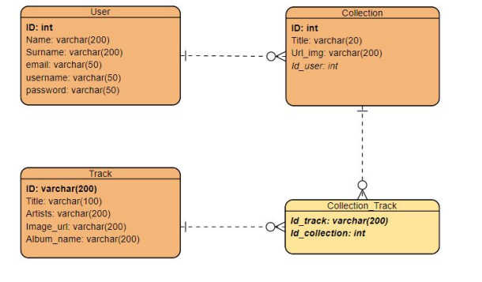
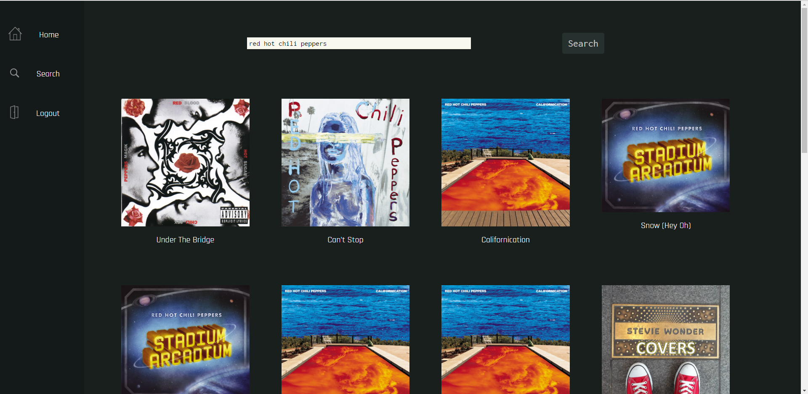
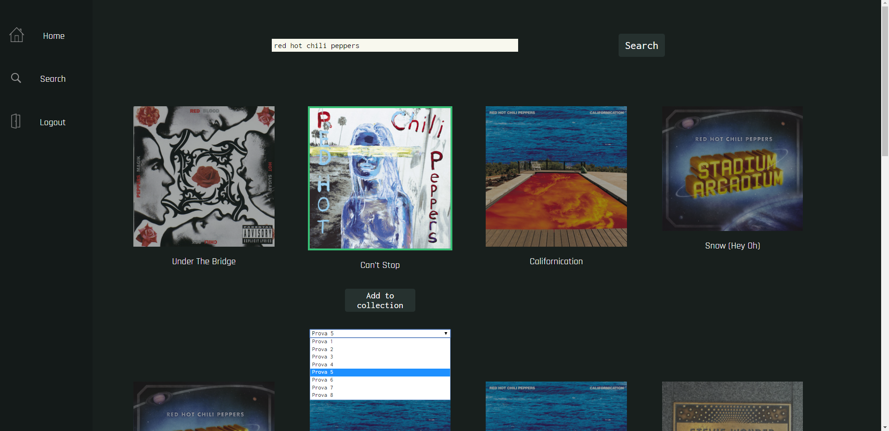

# spotify-like-webapp
A webapp in Laravel (PHP) that uses the REST API of Spotify. Written for my bachelor class 'Web Programming'.

## What
Cambio is a multi-user platform for managing playlists,
which leverages the *Search API* to obtain information from the catalog of
**Spotify** about millions of tracks. For each track, it displays
the image of the album to which it belongs, the song title, the name
of the album and the artists it belongs to.

## How
The webapp was developed using:
- Laravel, framework PHP
- JavaScript
- Bootstrap (CSS)
- MySQL Database
- Spotify's REST API

using a Model-View-Controller architecture.
### REST API
Spotify's Web APIs provide access to metadata on
music, artists, and albums. Several endpoints are provided that are associated
to the features offered. Spotify's Web APIs are based on the REST principles, meaning that each action is associated with the appropriate HTTP method
appropriate. 

The function used is the search function, whose endpoint
is: https://api.spotify.com/v1/search, it is necessary to make
requests through the GET method. Among the parameters of the request
one must specify a token in the header.

The necessary token can be obtained by registering your application
in Spotify's developer section which will lead eventually to the client_id and client_secret. 

Since Spotify is based on OAuth 2.0, one has to request the token through the dedicated endpoint:
https://accounts.spotify.com/api/token, specifying the parameter
"grant_type" to "client_credential" and adding a header that has
Base64("client_id:client_secret") as the value. The response is in
JSON format and contains the token if the authentication was successful.
successful, otherwise an error is returned. The token obtained
allows a number of operations, from which are excluded those on the data
of users, which instead require a different authorization.

### Search API
The only parameters required, besides the token in the header, are *q* and
*type*, which indicate the *query* to be searched and the *type* of the
search.

Valid "types" are: album, artist, playlist, track. 

The
Cambio platform fixes the type=track parameter, so as to
have an image returned in each case. The search returns a JSON, which contains an array of tracks.
From each of these the title, album, image, and the
artists.

### Component Interaction Diagram
In purple the web pages while in green there are the back-end components, which use the database and the external API.

### ER Diagram

## Screenshots

### User home page

### Search page

### Search page - add to collection

